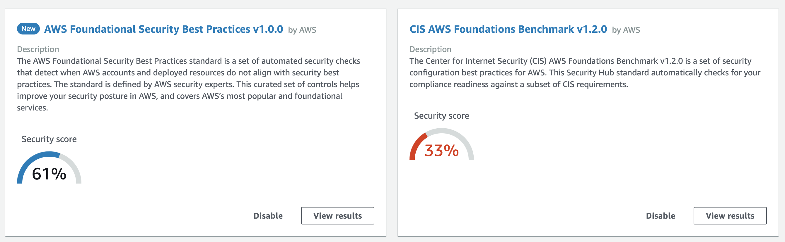

## AWS SecurityHub - Cloudformation template with inline Lambda

#### Description:  

 This Cloudformation template enables Security Hub for your account in the Region the CF template is deployed.
The AWS::SecurityHub::Hub resource in Cloudformation doesn't automatically enable "CIS AWS Foundations" & "AWS Foundational Security Best Practices".
In this template, an inline lambda is used to accomplish that task, and it enables Security Hub using lambda which enables the standards such as CIS AWS Foundations & AWS Foundational Security Best Practices. 

